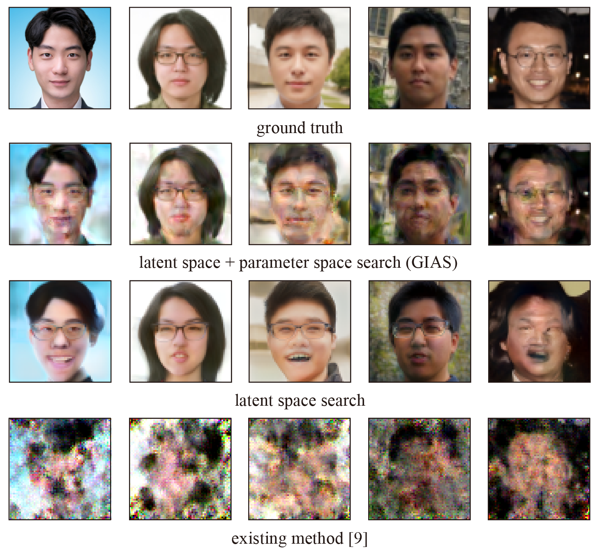

# Gradient Inversion with Generative Image Prior

This repository is an implementation of "Gradient Inversion with Generative Image Prior", accepted to NeurIPS 2021.
[https://arxiv.org/abs/2110.14962](https://arxiv.org/abs/2110.14962)

### Abstract:
Federated Learning (FL) is a distributed learning framework, in which the local data never leaves clients’ devices to preserve privacy, and the server trains models on the data via accessing only the gradients of those local data. Without further privacy mechanisms such as differential privacy, this leaves the system vulnerable against an attacker who inverts those gradients to reveal clients’ sensitive data. However, a gradient is often insufficient to reconstruct the user data without any prior knowledge. By exploiting a generative model pretrained on the data distribution, we demonstrate that data privacy can be easily breached. Further, when such prior knowledge is unavailable, we investigate the possibility of learning the prior from a sequence of gradients seen in the process of FL training. We experimentally show that the prior in a form of generative model is learnable from iterative interactions in FL. Our findings strongly suggest that additional mechanisms are necessary to prevent privacy leakage in FL.



## Code
The central file that contains the reconstruction algorithm can be found at ```inversefed/reconstruction_algorithms.py```. 

### Setup:
Requirements:
```
pytorch
torchvision
lpips
pyyaml
```
We included our conda environment as `environment.yml`, but do not use it directly because your environment is probably different from ours. e.g. cudatoolkit version.

To run experiments, you need to download ImageNet, FFHQ, or any dataset you want and provide its location. For FFHQ dataset, download json directory of https://github.com/DCGM/ffhq-features-dataset and move into your FFHQ dataset directory. Age in the attribute file will be used as label.

For stylegan, we did not included pretrained models. You should bring your model and edit `inversefed/porting.py`. For stylegan2 model and FFHQ dataset, you can download [this model](https://www.dropbox.com/s/k5ql7yyjl2i9dno/Gs.pth?dl=0) into `inversefed/genmodels/stylegan2/Gs.pth`. Note that the model is obtained from [other stylegan repo](https://github.com/adriansahlman/stylegan2_pytorch) and follows NVIDIA license. That is, it is restricted to non-commercial use only.


### Scripts
We provide scripts to reproduce our results. Before running script, read scripts carefully and set parameters as you want. 

scripts should be executed from root directory, for example :

```
python scripts/ours_v2_bs4.sh
```

### How to cite


```
@inproceedings{jeon21gigip,
  title={Gradient Inversion with Generative Image Prior},
  author={Jinwoo Jeon and Jaechang Kim and Kangwook Lee and Sewoong Oh and Jungseul Ok},
  booktitle={Advances in Neural Information Processing Systems},
  year={2021}
}
```


### Note

Our code is based on https://github.com/JonasGeiping/invertinggradients.

For DCGAN implementation, we used

* https://github.com/csinva/gan-vae-pretrained-pytorch

* https://github.com/DmitryUlyanov/deep-image-prior

For Stylegan2 implementation, we used

* https://github.com/NVlabs/stylegan2-ada-pytorch
* https://github.com/adriansahlman/stylegan2_pytorch

BNStatisticsHook from

* https://github.com/NVlabs/DeepInversion

